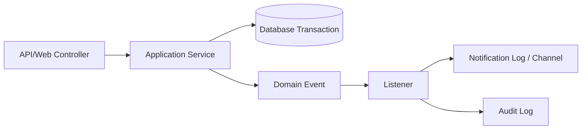

# Arsitektur Perangkat Lunak GCMS

GCMS dibangun sebagai aplikasi Laravel modular dengan pendekatan Clean Architecture dan prinsip Domain-Driven Design (DDD). Tujuannya adalah memisahkan aturan bisnis pengaduan dari detail transport HTTP, database, queue, dan antarmuka admin sehingga fitur dapat diuji dan dikembangkan secara bertahap.

## Tujuan Arsitektur

1. Menjaga aturan bisnis pengaduan, workflow, SLA, dan notifikasi tetap eksplisit.
2. Memisahkan endpoint API/web dari service aplikasi.
3. Membuat transisi workflow dapat diaudit dan dikembangkan tanpa mengubah controller.
4. Menyediakan pondasi untuk web portal, panel admin, API mobile, queue, scheduler, dan realtime event.
5. Menjaga data pemerintah daerah, OPD, wilayah, dan master data sebagai konfigurasi domain.

## Layer Clean Architecture

### 1. Domain Layer

Lokasi utama: `app/Domain`.

Domain berisi model Eloquent yang mewakili bahasa bisnis GCMS:

- `Complaint`, `ComplaintStatus`, `ComplaintCategory`, `ComplaintSubCategory`, `Priority`
- `Workflow`, `WorkflowNode`, `WorkflowAction`, `WorkflowTransition`, `WorkflowHistory`
- `Opd`, `Unit`, `Division`
- `Province`, `Regency`, `District`, `Village`
- `LoginHistory`, `OtpCode`, `UserDevice`, `AuditLog`
- `NotificationLog`, `NotificationMedia`

Domain juga menyimpan enum dan event:

- `ComplaintStatusCode` untuk status pengaduan.
- `WorkflowActionCode` untuk aksi workflow.
- `UserRole` untuk role pengguna.
- `ComplaintCreated` dan `ComplaintTransitioned` untuk event domain.

### 2. Application Layer

Lokasi utama: `app/Application`.

Layer ini menjalankan use case:

- `ComplaintService::create()` membuat pengaduan, memilih workflow default, menentukan node awal, membuat timeline, dan mencatat history.
- `WorkflowEngine::transition()` memvalidasi aksi, memindahkan node, memperbarui status, mencatat history, dan menerbitkan event.
- `AuthService::login()` dan `AuthService::register()` mengelola login JWT, status aktif, dan riwayat login.
- `ReportService`, `DashboardService`, `NotificationService`, dan `AuditService` menampung logic aplikasi lintas controller.

DTO seperti `CreateComplaintData` dan `TransitionComplaintData` menjadi kontrak input use case agar controller tidak membawa detail HTTP ke domain.

### 3. Infrastructure Layer

Lokasi utama: `app/Infrastructure`.

Layer ini berisi implementasi repository dan persistence:

- `ComplaintRepository`
- `WorkflowRepository`

Repository membungkus query penting seperti pencarian workflow aktif/default dan daftar transisi dari node tertentu. Jika di masa depan data workflow berasal dari service eksternal, perubahan dapat dilokalisasi pada layer ini.

### 4. Interface / Delivery Layer

Lokasi utama: `app/Http`, `routes`, dan `app/Providers/Filament`.

Delivery layer menerima request dan mengembalikan response:

- API v1 di `routes/api.php`.
- Portal web masyarakat di `routes/web.php`.
- Filament Admin Panel di `/admin`.
- Form request untuk validasi input.
- API Resource untuk format response JSON.

Controller tidak mengatur detail workflow; controller menerjemahkan request menjadi DTO lalu memanggil service aplikasi.

## Modul Fungsional

### Auth dan Pengguna

Fungsi:

- Login JWT untuk API.
- Register masyarakat.
- OTP untuk login/register/reset.
- Riwayat login.
- Role dan permission berbasis Spatie Permission.

Role awal:

- `SUPER_ADMIN`
- `ADMINISTRATOR`
- `ADMIN_OPD`
- `ADMIN_UNIT`
- `SUPERVISOR`
- `PETUGAS`
- `MASYARAKAT`

### Complaint Management

Fungsi:

- Buat pengaduan.
- Daftar dan detail pengaduan.
- Timeline pengaduan.
- Komentar dan lampiran.
- SLA berdasarkan prioritas.
- Tracking ticket publik.

Pembuatan pengaduan menghasilkan:

- Nomor tiket `GCMS-YYYYMMDD-0001`.
- Status awal `NEW`.
- Node workflow awal.
- Timeline `created`.
- Workflow history `START`.
- Event `ComplaintCreated`.

### Workflow

Workflow default:

```text
START -> VERIFY -> OPD -> PETUGAS -> OPD -> DONE
```

Aksi utama:

- `VERIFY`
- `FORWARD`
- `ASSIGN`
- `APPROVE`
- `CLOSE`

Setiap transisi mengubah node saat ini, role saat ini, PIC/OPD jika relevan, status target, dan history. Transisi juga memicu event `ComplaintTransitioned`.

### Master Data

Master data meliputi:

- OPD, unit, dan divisi.
- Kategori dan subkategori pengaduan.
- Prioritas dan SLA.
- Status pengaduan.
- Wilayah administrasi.
- Jenis lampiran.
- Media notifikasi.
- Jam kerja.
- Pengaturan daerah.

### Notification dan Audit

Event domain diterima listener/notifier untuk mencatat atau mengirim notifikasi. Audit log menyimpan aksi penting dengan user, target entity, perubahan data, IP, user agent, dan deskripsi.

## Event Driven Flow

GCMS memakai event Laravel untuk memisahkan transaksi inti dari side effect.



Contoh event:

- `ComplaintCreated` setelah pengaduan berhasil dibuat.
- `ComplaintTransitioned` setelah workflow berpindah.

Side effect sebaiknya dijalankan lewat queue agar request user tetap cepat.

## Boundary dan Dependency Rule

Aturan dependency:

- Controller boleh bergantung pada service aplikasi, request, resource.
- Service aplikasi boleh memakai model domain, DTO, repository, event.
- Domain tidak boleh bergantung pada controller.
- Repository mengandung detail query persistence.
- Dokumentasi API tidak menjadi sumber kebenaran utama; route dan request validation tetap sumber runtime.

## Deployment Runtime

Runtime Docker terdiri dari:

- `nginx` sebagai reverse proxy HTTP.
- `app` menjalankan PHP-FPM.
- `queue` menjalankan `php artisan queue:work`.
- `scheduler` menjalankan `php artisan schedule:work`.
- `reverb` menjalankan websocket server.
- `mysql` sebagai database.
- `redis` untuk cache/session/queue.

## Observability Dasar

Sumber observability:

- `storage/logs/laravel.log`
- tabel `login_histories`
- tabel `audit_logs`
- tabel `notification_logs`
- tabel `workflow_histories`
- timeline pengaduan

Untuk production, log aplikasi sebaiknya dikirim ke log aggregator dan queue worker dipantau dengan supervisor/orchestrator.
