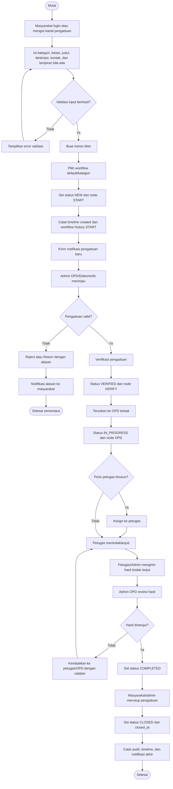

# Activity Diagram Pengaduan

Alur berikut menunjukkan proses dari pembuatan pengaduan sampai ditutup.

## Titik Kontrol

- Validasi input dilakukan oleh `StoreComplaintRequest`.
- Nomor tiket dibuat di `ComplaintService`.
- Transisi workflow dilakukan oleh `WorkflowEngine`.
- Setiap perubahan status menghasilkan `workflow_histories` dan `complaint_timelines`.
- Event domain dapat memicu notifikasi asynchronous lewat queue.
