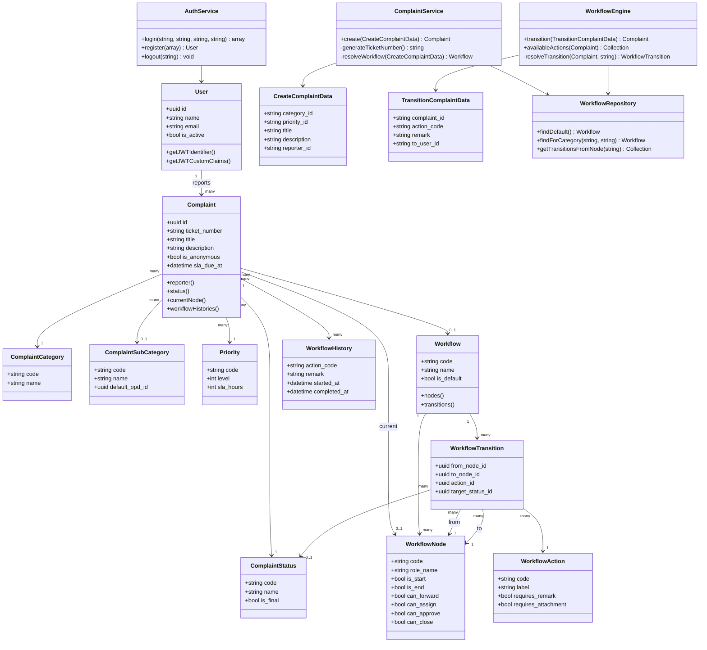

# Class Diagram Inti GCMS

Diagram berikut menampilkan kelas inti pada domain pengaduan, workflow, auth, dan service aplikasi.

## Catatan Desain

- DTO menjaga input use case tetap eksplisit.
- Service aplikasi mengatur transaksi dan event domain.
- Model domain menyimpan relasi dan state utama.
- Repository melokalisasi query workflow yang dipakai service.
