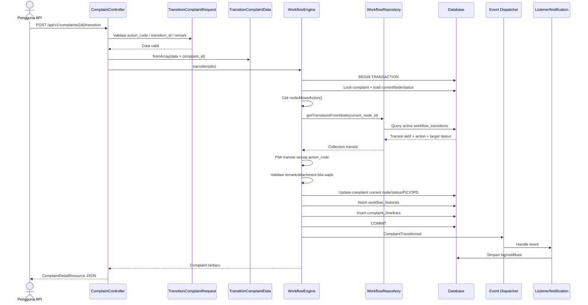

# Sequence Diagram Transisi Workflow

Diagram ini menjelaskan alur ketika pengguna melakukan aksi workflow, misalnya `VERIFY`, `FORWARD`, `ASSIGN`, `APPROVE`, atau `CLOSE`.

## Validasi Utama

- `action_code` wajib bila `transition_id` tidak dikirim.
- Action harus didukung capability node saat ini, misalnya `can_forward`.
- Transition aktif harus tersedia dari node saat ini.
- Remark wajib untuk action yang ditandai `requires_remark`.
- Target user harus ada bila `to_user_id` dikirim.

## Efek Data

Setelah transisi berhasil:

- `complaints.current_node_id` berubah.
- `complaints.status_id` berubah bila transition punya target status.
- `complaints.responded_at`, `resolved_at`, atau `closed_at` dapat terisi.
- `workflow_histories` bertambah satu record.
- `complaint_timelines` bertambah satu record.
- Event `ComplaintTransitioned` dipublikasikan.
