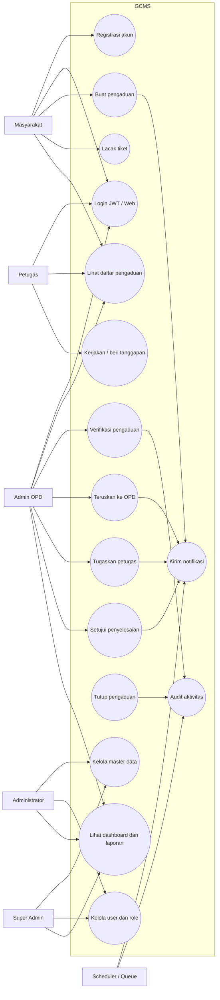

# Diagram Use Case GCMS

Diagram ini merangkum interaksi aktor utama dengan sistem.

## Aktor

- **Masyarakat**: pelapor, membuat pengaduan, memantau status, dan melihat riwayat.
- **Admin OPD**: melakukan verifikasi, meneruskan, menugaskan, dan menyetujui pengaduan.
- **Petugas**: menangani pengaduan teknis dan mengirim hasil tindak lanjut.
- **Administrator**: mengelola master data, user, role, dashboard, dan laporan.
- **Super Admin**: mengelola konfigurasi penuh lintas modul.
- **Scheduler/Queue**: menjalankan pekerjaan latar seperti notifikasi, SLA reminder, dan audit async.

## Use Case Kritis

1. Buat pengaduan menghasilkan nomor tiket dan workflow history awal.
2. Verifikasi memastikan pengaduan valid sebelum diteruskan.
3. Penugasan menentukan PIC atau unit pelaksana.
4. Persetujuan dan penutupan mengakhiri lifecycle.
5. Dashboard dan laporan dipakai pimpinan untuk memantau tren dan SLA.
